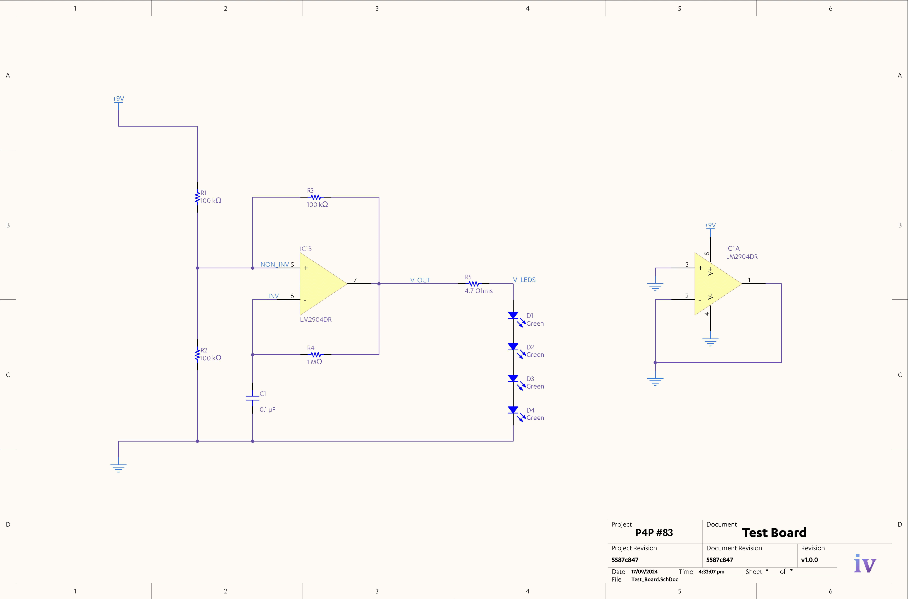

# `test-board`

> [!NOTE]
> Refer to [`p4p.jamesnzl.xyz/learn`](https://p4p.jamesnzl.xyz/learn) for full details.

This repository contains the Altium design files for our calibration and testing printed circuit board.

The board contains variably-spaced fiducial markings to be used in the machine's calibration routine, and a basic operational amplifier oscillator circuit that flashes an array of LEDs when excited with a nine-volt battery.

## Circuit Schematic

### Bill of Materials

The board is designed to use only parts stocked at the [ECSE Component Store](https://iam.auckland.ac.nz/profile/SAML2/Redirect/SSO?execution=e1s1).

#### Oscillator

- 1x TLC082 operational amplifier
- 3x 100k 0805 chip resistors
- 1x 1M 0805 chip resistor
- 1x 0u1/100n 0805 ceramic capacitor

#### LEDs

- 1x 4R7 0805 current limiting chip resistor
- 4x 0805 LEDs

#### Supply

- 1x 9V battery

## 3D Render

