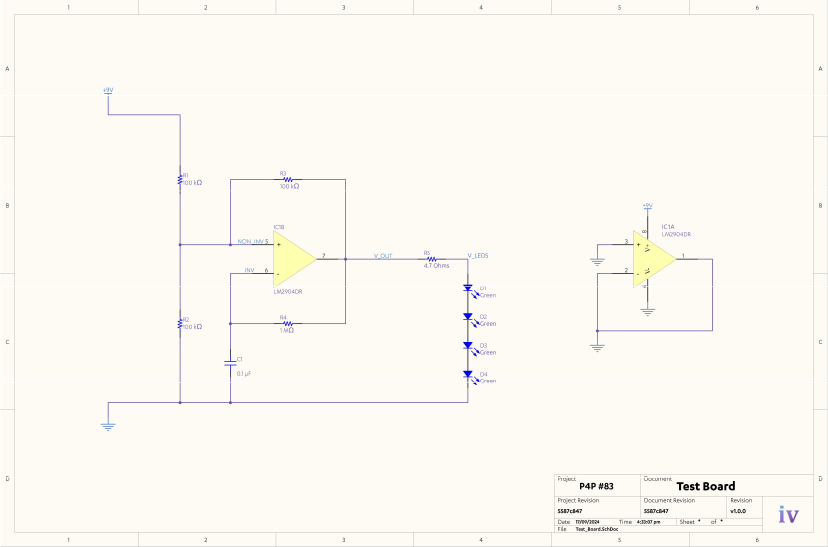
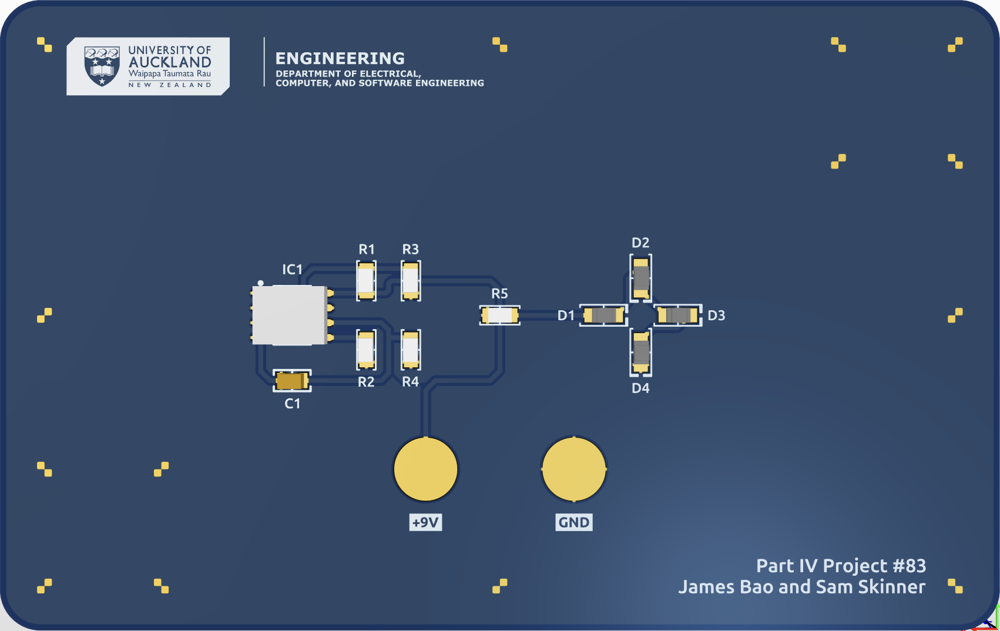

# `test-board`

> [!NOTE]
> Refer to [`p4p.jamesnzl.xyz/learn`](https://p4p.jamesnzl.xyz/learn) for full details.

This repository contains the Altium design files for our calibration and testing printed circuit board.

The board contains variably-spaced fiducial markings to be used in the machine's calibration routine, and a basic operational amplifier oscillator circuit that flashes an array of LEDs when excited with a nine-volt battery.

